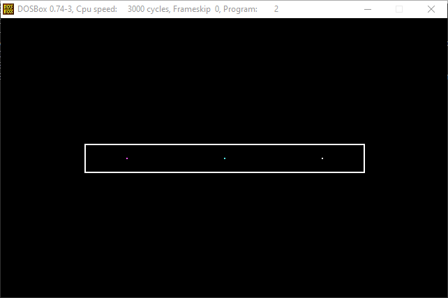

# Práctica 1: Introducción a la programación de periféricos

1. Programa que use la función de interrupción de cambio de modo de vídeo (usar el modo texto 40x25) y mostrar una cadena de texto para comprobar el funcionamiento. Antes de terminar, hacer una pausa esperando la pulsación de una tecla, y restaurar el modo de vídeo de 80x25.

2. Programa que use la función de interrupción de cambio de modo de vídeo (usar el modo gráfico 320x200 color) y dibujar un rectángulo blanco en pantalla; a continuación, mostrar varios pixels de diferentes colores dentro del rectángulo.

