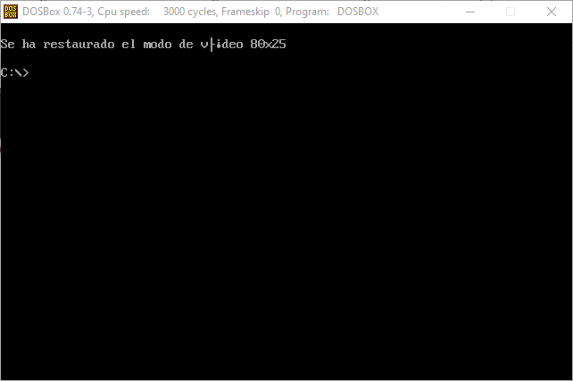

# Práctica 1: Introducción a la programación de periféricos

1. Programa que use la función de interrupción de cambio de modo de vídeo (usar el modo texto 40x25) y mostrar una cadena de texto para comprobar el funcionamiento. Antes de terminar, hacer una pausa esperando la pulsación de una tecla, y restaurar el modo de vídeo de 80x25.

Para la resolución de este ejercicio he creado varias macro para reconocer la pulsación de una tecla y para cambiar entre los modos.

Comenzamos con el modo vídeo 80x25 y llamamos a la función de espera de pulsación.

Una vez pulsada cualquier tecla pasamos al modo texto usando su macro. De mismo modo esperamos la pulsación de una tecla para cambiar al modo vídeo.

Tras la pulsación de la tecla se restaura el modo 80x25.

2. Programa que use la función de interrupción de cambio de modo de vídeo (usar el modo gráfico 320x200 color) y dibujar un rectángulo blanco en pantalla; a continuación, mostrar varios pixels de diferentes colores dentro del rectángulo.

Para la resolución de este ejercicio definimos el concepto de pixel, que tendrá una posición 2D (X,Y) y un color. Al igual que en el ejercicio anterior comenzamos en el modo vídeo 80x25 y al pulsar una tecla pasamos al modo gráfico 300x200.

En este modo he usado 4 bucles para pintar las líneas horizontales y verticales del rectángulo. El rectángulo abarca el área de (60, 90) a (260, 110) y dentro de ese triángulo se pueden encontrar 3 píxeles de colores distintos.

Tras presionar de nuevo una tecla se vuelve al modo anterior.

