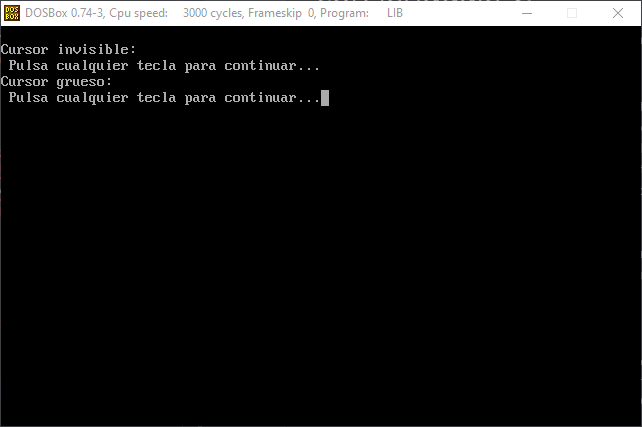

# Práctica 2: Entrada/Salida utilizando interrupciones con lenguaje C

Para el desarrollo de esta práctica debemos implementar 9 funciones a modo de biblioteca. Implementaremos las siguientes funciones:

+ `gotoxy`. Coloca el cursor en una posición determinada
+ `setcursortype`. Fijar el aspecto del cursor, debe admitir tres valores: INVISIBLE, NORMAL y GRUESO
+ `setvideomode`. Fija el modo de video deseado
+ `getvideomode`. Obtiene el modo de video actual
+ `textcolor`. Modifica el color de primer plano con que se mostrarán los caracteres
+ `textbackground`. Modifica el color de fondo con que se mostrarán los caracteres
+ `clrscr`. Borra toda la pantalla
+ `cputchar`. Escribe un carácter en pantalla con el color indicado actualmente
+ `getche`. Obtiene un carácter de teclado y lo muestra en pantalla

Como ejercicios adicionales implementaremos:

+ Una función que permita dibujar un recuadro en la pantalla en modo texto. Recibirá como parámetros las coordenadas superior izquierda e inferior derecha del recuadro, el color de primer plano y el color de fondo.
+ Un programa que establezca modo gráfico VGA para crear dibujos sencillos en pantalla.

##### Menú

Al ejecutar el programa muestro un menú que nos permite acceder a cada una de las funciones individualmente.

##### gotoxy

##### setcursortype

##### setvideomode

##### getvideomode

##### textcolor

##### textbackground

##### clrscr

##### cputchar

##### getche

##### Pintar rectángulo

