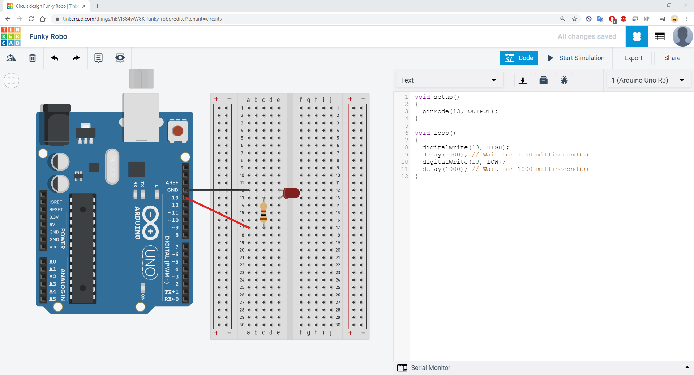

# Práctica 3: Experimentación con Arduino

Para el desarrollo de esta práctica debemos crear varios circuitos haciendo uso de Arduino. He optado por usar [Tinkercad](tinkercad.com) para modelar los circuitos y ejecutar la simulación.

##### Ejemplo

En el seminario dedicado a esta práctica vemos un ejemplo en el que tenemos un led en el circuito que se enciende y se apaga cada segundo.



##### Proyectos a implementar

1. Implementar el programa de parpadeo de LED, ampliándolo para que encienda y apague alternativamente tres LEDs (uno rojo, otro amarillo y otro verde), conectados a las salidas digitales 11, 12 y 13 del Arduino, a un intervalo de 1.5 segundos. Crear el esquema con Fritzing y cargar el programa en Arduino para comprobar que funciona correctamente.


Siguiendo el mismo esquema que en el ejemplo, lo único que hacemos es poner más leds en el circuito y configurlos para que se enciendan y se apaguen consecutivamente cada 1.5 segundos.

```c
void setup()
{
	pinMode(13, OUTPUT);
  	pinMode(12, OUTPUT);
  	pinMode(11, OUTPUT);
}

void loop()
{
    digitalWrite(13, HIGH);
    delay(1500);
	digitalWrite(13, LOW);
    digitalWrite(12, HIGH);
    delay(1500);
	digitalWrite(12, LOW);
    digitalWrite(11, HIGH);
    delay(1500);
    digitalWrite(11, LOW);
}
```

2. Partir del programa de parpadeo de LEDs anterior y ampliarlo con las modificaciones necesarias para que se encienda el LED rojo solo cuando se pulse un interruptor conectado a la entrada digital 7, y en ese momento se apaguen los LEDs amarillo y verde.


En este caso añadimos un botón, leemos la entrada del botón y para cada caso encendemos sólo el led rojo o el amarillo y verde.

```c
int val = 0;
void setup()
{
	pinMode(13, OUTPUT);
  	pinMode(12, OUTPUT);
  	pinMode(11, OUTPUT);
	pinMode(7, INPUT);

}

void loop()
{
  val = digitalRead(7);  // read input value
  if (val == LOW) {         // check if the input is LOW (button released)
    digitalWrite(13, HIGH);
    digitalWrite(12, LOW);
    digitalWrite(11, LOW);
    delay(1500);
    digitalWrite(13, LOW);
    delay(1500);

  } else {
	digitalWrite(13, LOW);
    digitalWrite(12, HIGH);
    delay(1500);
    digitalWrite(12, LOW);
	digitalWrite(11, HIGH);
    delay(1500);
	digitalWrite(11, LOW);
  }
}
```

3. Secuencia de LEDs, encendiendo y apagando 4 LEDs secuencialmente, de forma similar a las lucecitas de "El coche fantástico".


Para este proyecto he optado por usar ``goto`` para ejecutar cada bucle alternativamente. En cada bucle enciendo un led, hago una pausa y enciendo el siguiente.

```c
void setup()
{
  pinMode(13, OUTPUT);
  pinMode(12, OUTPUT);
  pinMode(11, OUTPUT);
  pinMode(10, OUTPUT);
  pinMode(9, OUTPUT);

}

void loop()
{
  derecha:
  for (int i = 13; i>=9; --i){
    if(i == 9){
    	goto izquierda;
    }
    digitalWrite(i, HIGH);
    delay(150); // Wait for 150 millisecond(s)
    digitalWrite(i, LOW);
    digitalWrite(i-1, LOW);
    delay(150); // Wait for 150 millisecond(s)
  }

  izquierda:
  for (int i = 9; i<=13; ++i){
    if(i == 13){
    	goto derecha;
    }
    digitalWrite(i, HIGH);
    delay(150); // Wait for 150 millisecond(s)
    digitalWrite(i, LOW);
    digitalWrite(i+1, LOW);
    delay(150); // Wait for 150 millisecond(s)
  }
}
```

4. Alarma por detección de presencia.


Para este ejercicio podemos reutilizar el código del segundo ejercicio. Tan sólo debemos comprobar la señal de entrada del detector y encender o apagar el led en función del resultado de la lectura.

```c
int val = 0;

void setup()
{
  pinMode(13, OUTPUT);
  pinMode(7, INPUT);
}

void loop()
{
  val = digitalRead(7);  // read input value
  if (val == HIGH) {         // check if the input is HIGH (button released)
    digitalWrite(13, HIGH);
  } else {
	digitalWrite(13, LOW);
  }
}
```
