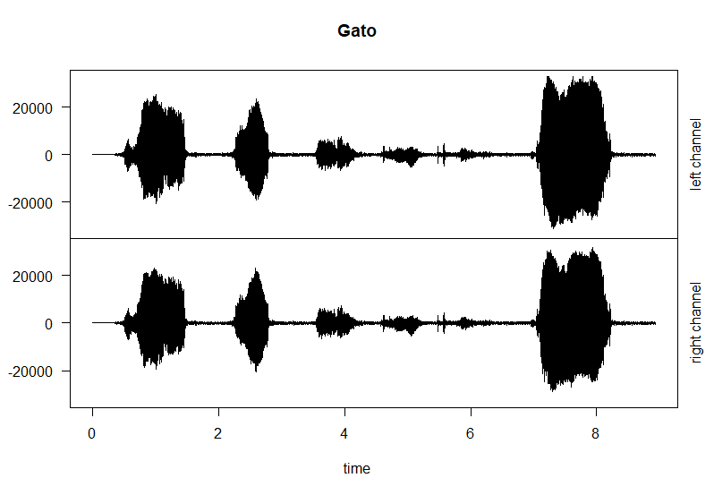
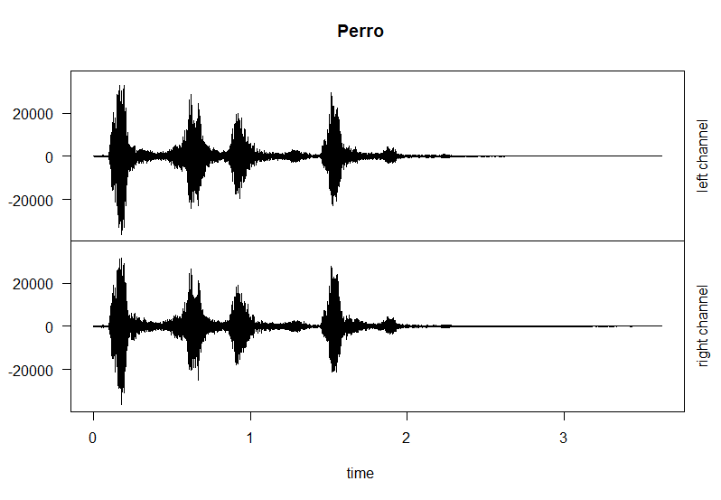
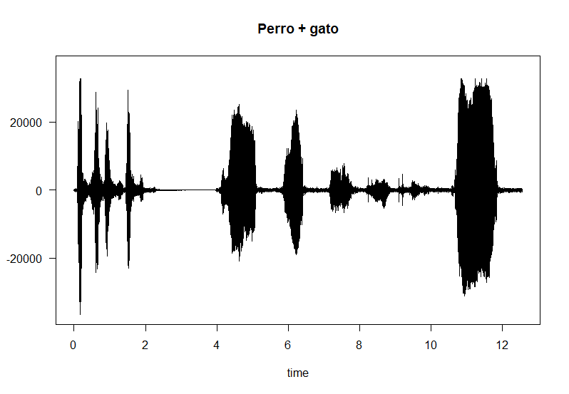
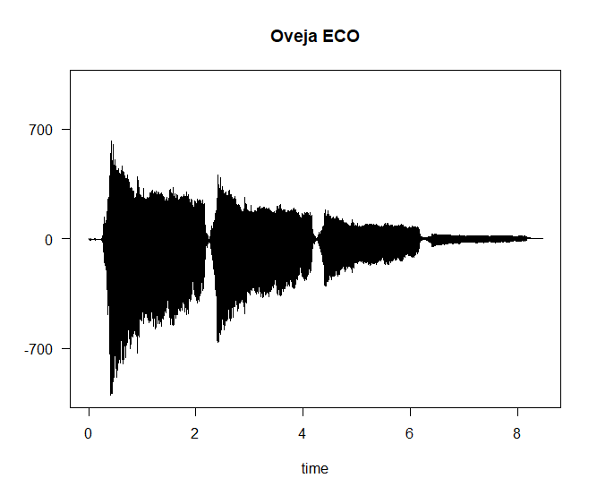
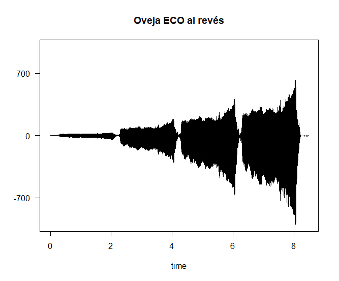

# Práctica 4: Experimentación con el sistema de salida de sonido

En el seminario 6 se introduce el trabajo con los ficheros de audio y en esta práctica trabajaremos con ellos usando los paquetes [tuneR](https://cran.r-project.org/web/packages/tuneR/index.html) y [seewave](https://cran.r-project.org/web/packages/seewave/index.html) pertenecientes al entorno de R.

Para el desarrollo de la práctica se propone el uso de las siguientes funciones estudiadas previamente:
 - `readWave()`: Leer una onda de sonido.
 - `readMP3()`: Leer un fichero MP3.
 - `str()`: Obtener información de la cabecera.
 - `listen()`: Reproducir el fichero leído.
 - `plot()`: Dibujar onda de sonido.
 - `cutw()`: Cortar onda de sonido.
 - `pastew()`: Pegar onda de sonido.
 - `deletew()`: Borrar la onda.
 - `bwfilter()`: Aplicar un filtro de frecuencia a la onda.
 - `echo()`: Aplicar efecto de eco.
 - `revw()`: Dar la vuelta al sonido (reverse).


#### Cuestiones a resolver

Antes de comenzar a resolver los problemas, lo primero que debemos hacer es instalar los paquetes que vamos a usar y cargarlos. Para ello ejecutamos lo siguiente:

```
install.packages('tuneR', dep=TRUE)
install.packages('seewave', dep=TRUE)

library(tuneR)
library(seewave)
library(audio)
```

1. Leer dos ficheros de sonido (WAV o MP3) de unos pocos segundos de duración cada uno.

```
perro <- readWave('./sonidos/perro.wav')
perro
listen(perro)

gato <- readMP3('./sonidos/gato.mp3')
gato
listen(gato)
```

2. Dibujar la forma de onda de ambos sonidos.

```
plot(extractWave(gato, from = 1, to = length(gato)), main="Gato")
plot(extractWave(perro, from = 1, to = length(perro)), main="Perro")
```






3. Obtener la información de las cabeceras de ambos sonidos.

```
> str(gato)
Formal class 'Wave' [package "tuneR"] with 6 slots
  ..@ left     : int [1:393984] 0 0 0 0 0 0 0 0 0 0 ...
  ..@ right    : int [1:393984] 0 0 0 0 0 0 0 0 0 0 ...
  ..@ stereo   : logi TRUE
  ..@ samp.rate: num 44100
  ..@ bit      : num 16
  ..@ pcm      : logi TRUE
> str(perro)
Formal class 'Wave' [package "tuneR"] with 6 slots
  ..@ left     : num [1:159732] 0 0 0 0 0 ...
  ..@ right    : num [1:159732] 0 0 0 0 0 ...
  ..@ stereo   : logi TRUE
  ..@ samp.rate: int 44100
  ..@ bit      : int 16
  ..@ pcm      : logi TRUE
```

4. Unir ambos sonidos en uno nuevo.

Como hemos visto en las ondas del ejercicio 2, la señal del sonido del perro tiene menos amplitud, por lo que antes de unir los sonidos he decidido normalizarlos.

```
perro@left <- perro@left * (max(gato@left)/max(perro@left))
perro@right <- perro@right * (max(gato@right)/max(perro@right))
perro_gato <- pastew(gato, perro, output="Wave")

listen(perro_gato)
```

Ahora tienen el mismo pico máximo en ambos canales, cosa que podemos ver a continuación.

5. Dibujar la forma de onda de la señal resultante.

```
plot(extractWave(perro_gato, from = 1, to = length(perro_gato)), main="Perro + gato")
```




6. Pasarle un filtro de frecuencia para eliminar las frecuencias entre 10000Hz y 20000Hz

```
filtro_perro_gato <- bwfilter(perro_gato, f = perro_gato@samp.rate, channel = 1,
    n = 1, from = 10000, to = 20000, bandpass = TRUE, output = "Wave")
```


7. Almacenar la señal obtenida como un fichero WAV denominado “mezcla.wav”.

```
writeWave(filtro_perro_gato, file.path("./sonidos/mezcla.wav"))
```

8. Cargar un nuevo archivo de sonido, aplicarle eco y a continuación darle la vuelta al sonido. Almacenar la señal obtenida como un fichero WAV denominado “alreves.wav”.

```
oveja <- readWave('./sonidos/oveja.wav')

ovejaECO <- echo(oveja, f = oveja@samp.rate, amp = c(0.66, 0.3, 0.05), delay = c(2, 4, 6), output = "Wave")

ovejaECOalreves <- revw(ovejaECO, output="Wave")
writeWave(ovejaECOalreves, file.path("./sonidos/alreves.wav"))
```




