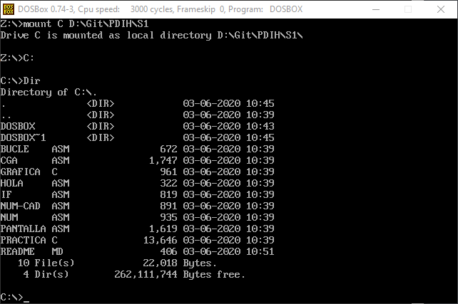
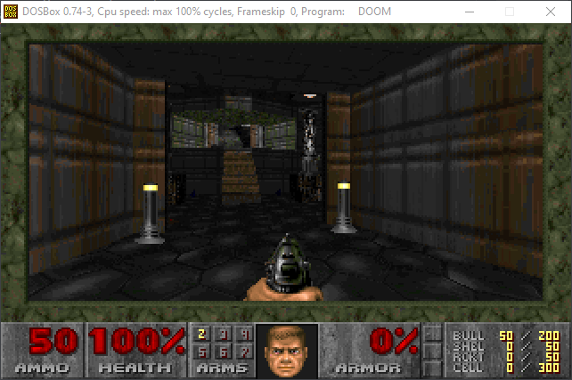
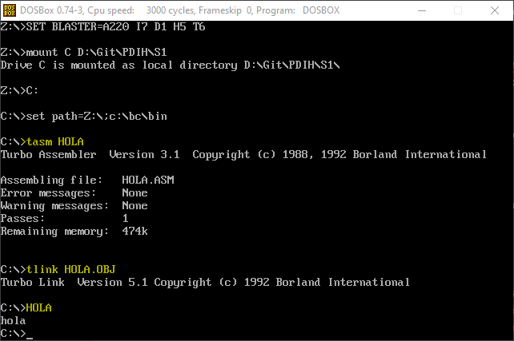
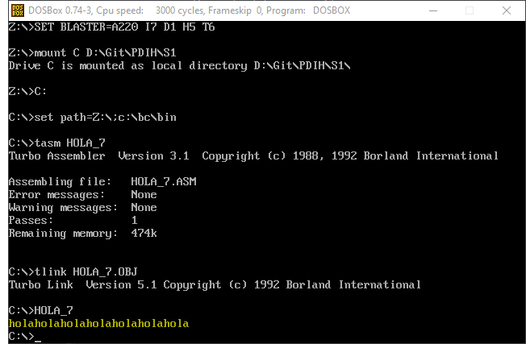

# Seminario 1: Programación de dispositivos a bajo nivel

#### 1. Instalar el software DOSBox y ejecutar aplicaciones de MS-DOS (p.ej. juegos clásicos).

Para la instalación del software he seguido el guión del seminario y lo he instalado en un sistema Windows 10 de 64 bits.

Tras instalarlo configuro la opción para montar automáticamente un directorio modificando el archivo `C:\Users\baugd\AppData\Local\DOSBox\dosbox-0.74-3.conf` y añadiendo al final del mismo `mount C D:\Git\PDIH\S1;` y `C:`.

De esta forma monto el directorio de trabajo y accedo directamente a él.

Para el primer ejercicio he descargado el juego DOOM y desde la consola he ejecutado el .exe.

#### 2. Configurar el inicio de DOSBox para que monte en la unidad C: el directorio donde se encuentra el entorno de programación Borland C (que incluye las herramientas para compilar no sólo lenguaje C, sino también ensamblador). Añadir a la variable “PATH” de inicio el directorio “bin” donde se encuentra el ejecutable BC.EXE.

En el directorio S1 extraigo todo lo relativo a Bordlan C, con lo que para añadirlo al path lo único que he tenido que hacer es `set path=%path%;c:\bc\bin`.

Una vez hecho esto ya podemos usar tanto *tasm* como *tlink*.

#### 3. Crear el ejemplo “Hola mundo” en ensamblador, compilarlo y comprobar su funcionamiento. A continuación incluir un bucle para mostrar el mensaje 7 veces.

Para comprobar el funcionamiento de Bordlan C hacemos lo siguiente:

Con *tasm* compilamos el archivo, con *tlink* enlazamos el .obj y generamos el ejecutable. Después tan sólo tenemos que ejecutarlo.

Para la inclusión del bucle que nos repita 7 veces hola añadimos lo siguiente al archivo `hola.asm`:

~~~
xor cx, cx      ; Inicializar a 0

bucle:
    mov dx, OFFSET msg
    mov ah, 9   ; Función para hacer print
int 21h     ; Llamamos a la función
    inc cx      ; Incrementar cx
    cmp cx, 7   ; Comprobar si cx es 7
    jne bucle   ; Si cx != 7 volvemos a iterar
~~~

Con el código anterior añadimos un contador que aumentamos en cada iteración hasta llegar a 7.

